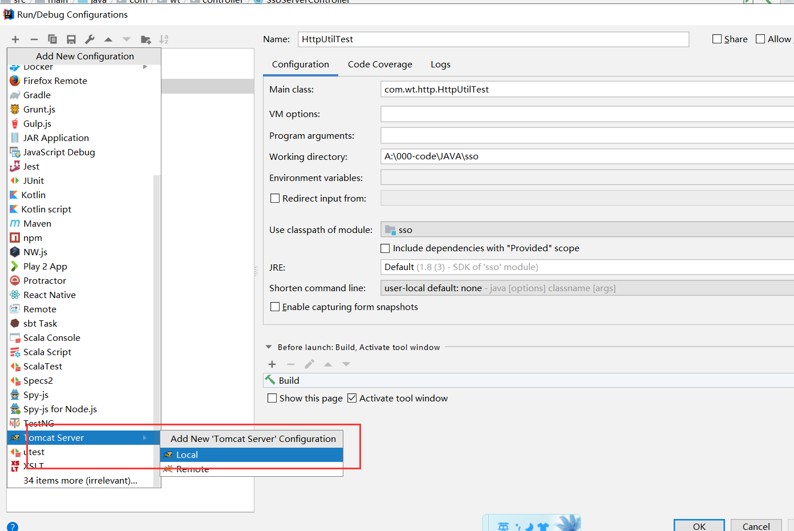
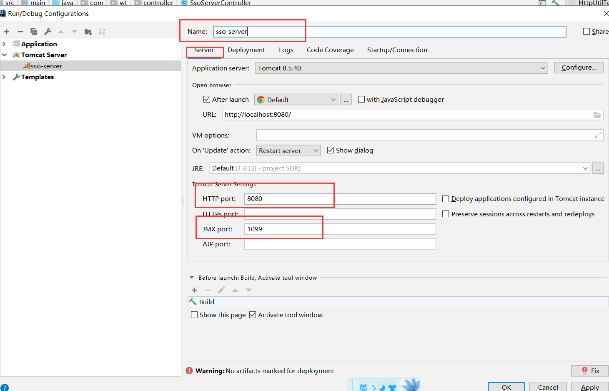
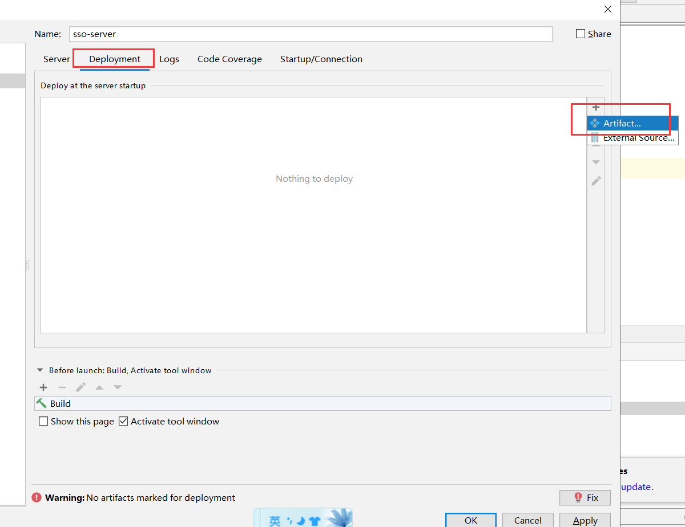
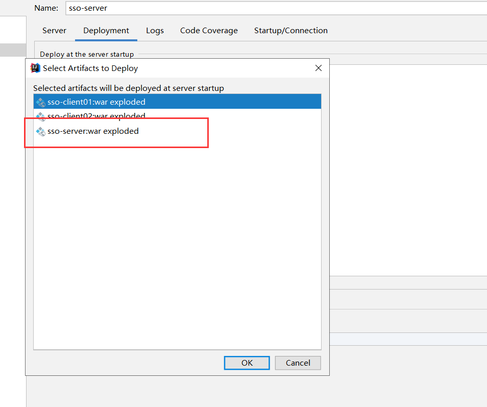
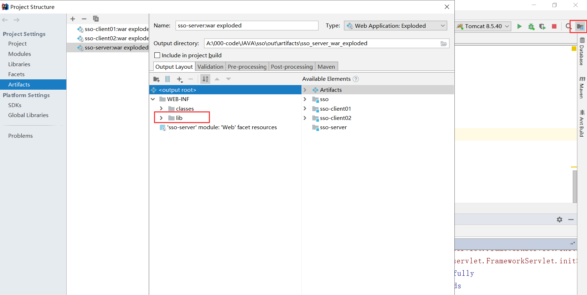
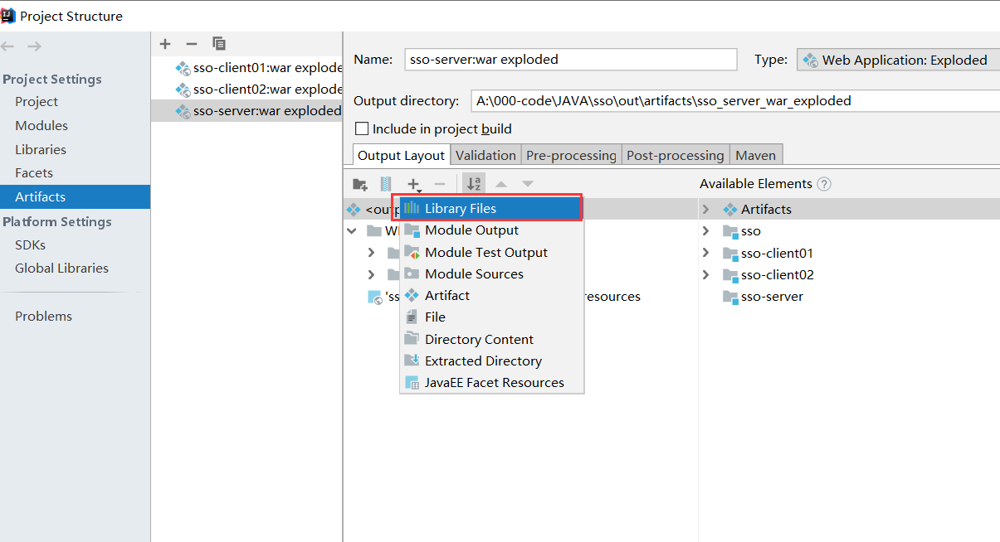
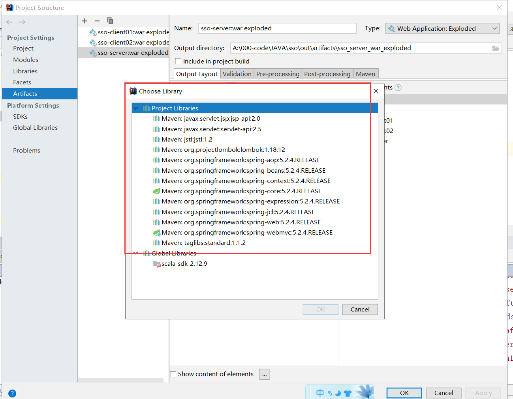
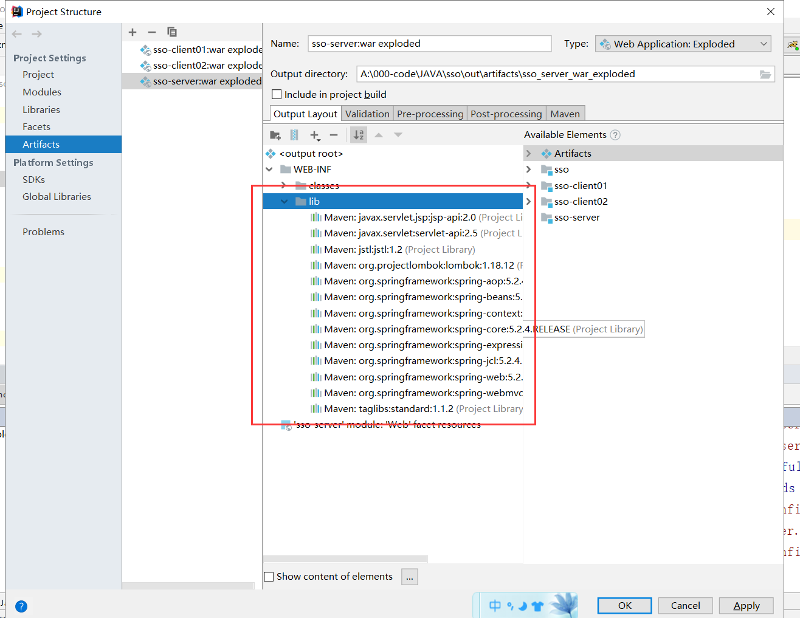
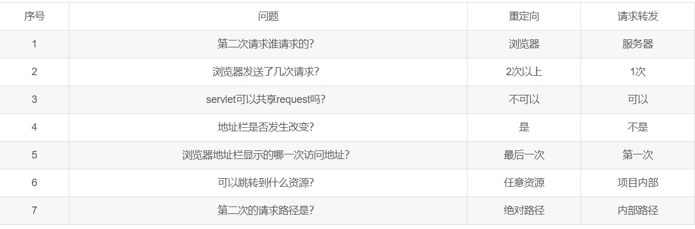

## 1. SSO的常用的解决办法

1. nginx的iphash

   实现原理：

   - 实现的方式就是在nginx的配置文件上添加一个iphash的配置，以后这个用户的请求都会被分发到他第一次登陆的那个服务器上；

   不足：

   - 这样他就有单点故障，破坏了原本nginx做负载均衡的初衷！

2. Session共享

   实现原理：

   - 当用户在众多服务器上的一台服务器进行登录，那么这服务器就会把他的session共享给其他的服务器，通过网络请求的方式，这样可以实现用户登录一次在多个服务器上都登录；

   不足:

   - 每个服务器上都存储session，浪费空间，影响性能
   - 网络请求是不可靠的，有时延的，当集群的数据过多的时候，有可能用登录的那他服务器session还没有共享过来；

3. 通过Redis进行第三方的存储

   实现原理：

   - 在登录的时候将用户登录的session以key-value的形式put进redis中，当请求到某一个服务器上的时候，服务器根据key去redis中查value（用户的登陆信息），有的话就不需要进行二次登录了

     key：只要保证唯一就行了（uuid）

     value：用户的session信息

     **这里就有一个很重要的问题：我们在把登录信息存放到Redis中的时候，同时需要将这个key返回给客户端，客户端将其存放到cookie中，这样客户端在下一次请求的时候才能携带这个key，去Redis中验证用户的信息**

## 2. 一个普通的maven项目变成web项目

这个简单就是添加一个web的支持就好了，具体步骤见图片：

## 3. 请求转发和重定向的区别

